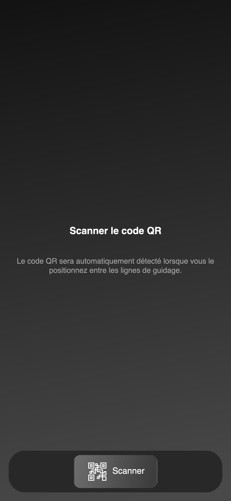
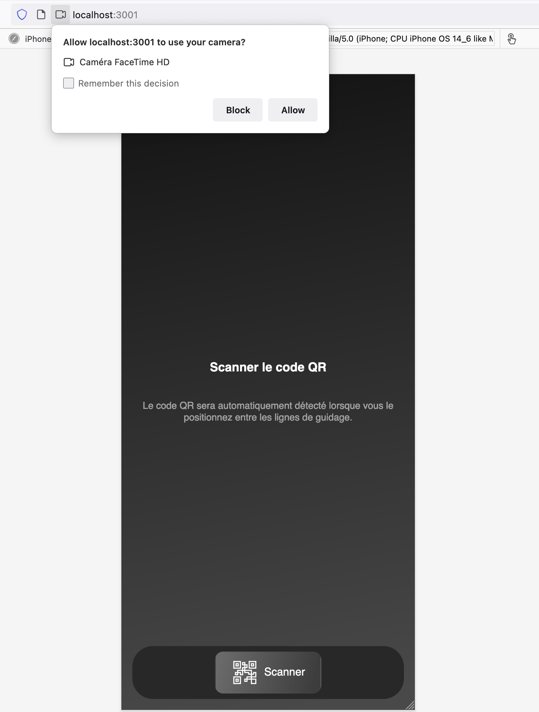
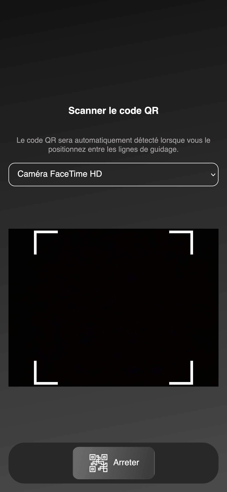
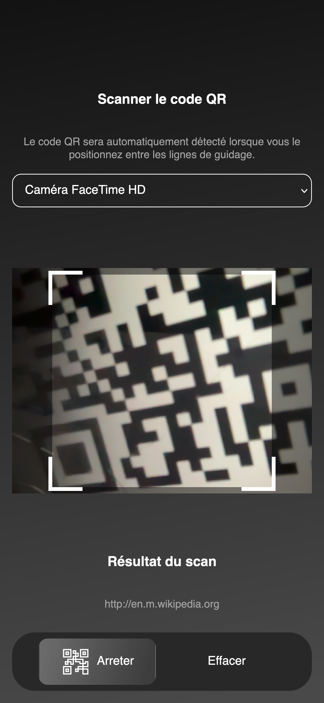

## Rapid qrcode scanner

Scanner du code QR avec la caméra de votre téléphone n'a jamais été aussi facile. Il suffit d'accéder à le site web et de pointer votre appareil photo vers le code QR. Le site web détectera automatiquement le code QR et vous montrera le résultat.

## Comment ça marche ?

Le site web utilise la technologie de détection de code QR avec la caméra de votre téléphone. 
Vous serrez donc amené à autoriser l'accès à votre caméra.

## Comment utiliser le site web ?

Le site web est très simple à utiliser. Il suffit d'aller sur le site web et de cliquer sur le bouton "Scanner" pour lancer la détection de code QR.
Veuillez donc à bien placer le code QR au centre de l'écran de votre téléphone.
Une fois le code QR détecté, le résultat s'affichera sur l'écran de votre téléphone.

## Captures d'écran

